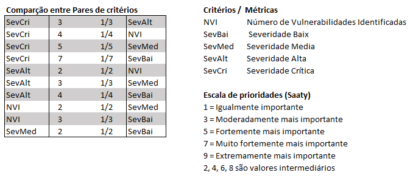

## Autores
Ali Iddar:iscente do curso Superior de Tecnologia em Redes de Computadores, CTISM--Universidade Federal de Santa
Maria (UFSM). E-mail: ali-iddar@redes.ufsm.br. 
Rogério C. Turchetti: Docente do curso Superior de Tecnologia em Redes de Computadores e do Mestrado Acadêmico PPGEPT--
CTISM--Universidade Federal de Santa Maria (UFSM). E-mail: turchetti@redes.ufsm.br.

## Resumo
Este estudo avalia o desempenho de ferramentas de análise de vulnerabilidades em imagens
Docker, utilizando o Processo de Análise Hierárquica (AHP) como metodologia de tomada de
decisão multicritério. Diante do crescente uso de contêineres Docker e dos riscos associados às
vulnerabilidades presentes nas imagens disponíveis no Docker Hub, a pesquisa visa comparar e
classificar as principais ferramentas destinadas à identificação dessas fragilidades. O AHP foi
aplicado em duas etapas: inicialmente, em cada estudo individualmente e, posteriormente, nos
resultados consolidados de todos os estudos. Os resultados indicaram que a escolha da ferramenta
deve levar em conta não apenas a eficácia geral, mas também fatores contextuais e a possibilidade
de utilizar múltiplas ferramentas para uma detecção mais precisa. A pesquisa destaca ainda a
necessidade de avaliações contínuas, especialmente em relação às abordagens de análise dinâmica
e suas comparações com ferramentas de análise estática.

## Tipo de Estudo:
Revisão Bibliográfica Sistemática / Artigo de pesquisa aplicada

Metodologia de Busca e selecção 

## Bases acadêmicas de busca
IEEE Xplore, EI Compendex, Web of Science, ACM Digital
Library, Scopus e Google Acadêmico

## Resultado de Busca
62 publicações

## Criterios de seleção

### Criterios de inclusão
1) Que utilizaram mais de uma ferramenta para análise de vulnerabilidades em imagens Docker;
2) Disponíveis gratuitamente;
3) Em português ou inglês;
4) Com foco na análise de vulnerabilidades em imagens Docker;
5) Artigos científicos, TCCs, dissertações, teses e casos de estudo

### Criterios de exclusão
1) Não tratam da análise de vulnerabilidades em imagens Docker;
2) Não revelam as ferramentas utilizadas;
3) Usaram ferramentas não disponibilizadas publicamente;
4) Utilizaram apenas uma ferramenta;
5) Em outros idiomas;
6) Duplicadas ou atualizadas, mantendo apenas a mais completa e a recente.

### Os trabalhos selecionados

| ID    | Estudo                                                                 | Ano  |
|-------|------------------------------------------------------------------------|------|
| Pub-1 | A Study on Container Vulnerability Exploit Detection                   | 2019 |
| Pub-2 | Container Vulnerability Scanners: An Analysis                          | 2020 |
| Pub-3 | An Analysis of Security Vulnerabilities in Container Images for Scientific Data Analysis | 2021 |
| Pub-4 | An Evaluation of Container Security Vulnerability Detection Tools       | 2021 |
| Pub-5 | Segurança em Imagens Docker: Um Estudo de Ferramentas de Análise Estática | 2021 |
| Pub-6 | Concerns About Available Container Image Scanning Tools and Image Security | 2022 |
| Pub-7 | Investigating the Inner Workings of Container Image Vulnerability Scanners | 2022 |
| Pub-8 | Continuous Docker Image Analysis and Intrusion Detection Based on Open-Source Tools | 2022 |
| Pub-9 | Vulnerability Analysis of Docker Hub Official Images and Verified Images | 2023 |
| Pub-10| Detecting Container Vulnerabilities Leveraging the CI/CD Pipeline       | 2023 |

 Processo de Análise Hierárquica (AHP) 

  
 O método AHP foi aplicado em duas etapas: 
1) aplicação do AHP em cada estudo individualmente: nesta etapa, o AHP é utilizado para classificar as ferramentas conforme as métricas e resultados específicos de cada estudo; 
2) aplicação do AHP nos resultados consolidados: após a análise individual, os resultados são consolidados e submetidos a uma nova aplicação do AHP para obter uma classificação geral das ferramentas. 
  
## Objtivo
Calssificar as ferramentas de analise de vulnerabilidades em imagend Docker.

## Montar a Matriz de Julgamento
### Comparações pareadas

Figura 1: Coparação pareada entre os critério

Como ilustrado na Figura acima, um critério - Severidade Crítica - pode ter importância moderada (valor 3) em relação a outro critério - Severidade Alta - (valor 1/3). Dentro de cada planinha uma justificativa para tal julgamento.

