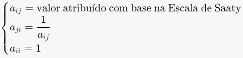

## Sobre o Projeto

Este estudo combina uma revisão bibliográfica sistemática com pesquisa aplicada para avaliar ferramentas de análise de vulnerabilidades em imagens Docker.

## Autores
Ali Iddar: Discente do curso Superior de Tecnologia em Redes de Computadores, CTISM--Universidade Federal de Santa
Maria (UFSM). E-mail: ali-iddar@redes.ufsm.br. 

Rogério C. Turchetti: Docente do curso Superior de Tecnologia em Redes de Computadores e do Mestrado Acadêmico PPGEPT--
CTISM--Universidade Federal de Santa Maria (UFSM). E-mail: turchetti@redes.ufsm.br.

## Resumo
Este estudo avalia o desempenho de ferramentas de análise de vulnerabilidades em imagens
Docker, utilizando o Processo de Análise Hierárquica (AHP) como metodologia de tomada de
decisão multicritério. Diante do crescente uso de contêineres Docker e dos riscos associados às
vulnerabilidades presentes nas imagens disponíveis no Docker Hub, a pesquisa visa comparar e
classificar as principais ferramentas destinadas à identificação dessas fragilidades. O AHP foi
aplicado em duas etapas: inicialmente, em cada estudo individualmente e, posteriormente, nos
resultados consolidados de todos os estudos. Os resultados indicaram que a escolha da ferramenta
deve levar em conta não apenas a eficácia geral, mas também fatores contextuais e a possibilidade
de utilizar múltiplas ferramentas para uma detecção mais precisa. A pesquisa destaca ainda a
necessidade de avaliações contínuas, especialmente em relação às abordagens de análise dinâmica
e suas comparações com ferramentas de análise estática.

Processo de Busca e Seleção 

## Bases acadêmicas de busca
A pesquisa foi realizada nas seguintes bases acadêmicas:

IEEE Xplore, EI Compendex, Web of Science, ACM Digital Library, Scopus e Google Acadêmico

Foram identificadas inicialmente 62 publicações, posteriormente filtradas segundo critérios específicos.

## Criterios de seleção

### Inclusão:
1) Que utilizaram mais de uma ferramenta para análise de vulnerabilidades em imagens Docker;
2) Disponíveis gratuitamente;
3) Em português ou inglês;
4) Com foco na análise de vulnerabilidades em imagens Docker;
5) Artigos científicos, TCCs, dissertações, teses e casos de estudo

### Exclusão:
1) Não tratam da análise de vulnerabilidades em imagens Docker;
2) Não revelam as ferramentas utilizadas;
3) Usaram ferramentas não disponibilizadas publicamente;
4) Utilizaram apenas uma ferramenta;
5) Em outros idiomas;
6) Duplicadas ou atualizadas, mantendo apenas a mais completa e a recente.

### Estudos Selecionados
Após aplicação dos critérios, foram selecionados 10 estudos publicados entre 2019 e 2023.

| ID    | Estudo                                                                 | Ano  |
|-------|------------------------------------------------------------------------|------|
| Pub-1 | A Study on Container Vulnerability Exploit Detection                   | 2019 |
| Pub-2 | Container Vulnerability Scanners: An Analysis                          | 2020 |
| Pub-3 | An Analysis of Security Vulnerabilities in Container Images for Scientific Data Analysis | 2021 |
| Pub-4 | An Evaluation of Container Security Vulnerability Detection Tools       | 2021 |
| Pub-5 | Segurança em Imagens Docker: Um Estudo de Ferramentas de Análise Estática | 2021 |
| Pub-6 | Concerns About Available Container Image Scanning Tools and Image Security | 2022 |
| Pub-7 | Investigating the Inner Workings of Container Image Vulnerability Scanners | 2022 |
| Pub-8 | Continuous Docker Image Analysis and Intrusion Detection Based on Open-Source Tools | 2022 |
| Pub-9 | Vulnerability Analysis of Docker Hub Official Images and Verified Images | 2023 |
| Pub-10| Detecting Container Vulnerabilities Leveraging the CI/CD Pipeline       | 2023 |

 Metodologia AHP (Processo de Análise Hierárquica) 

  
## Objtivo
  
Calssificar as ferramentas de analise de vulnerabilidades em imagend Docker.
  
## Implementação em Duas Fases
  
1) Análise Individual: Aplicação do AHP para cada estudo
2) Análise Consolidada: Aplicação do AHP nos resultados agregados
  
## Processo de Análise

### Comparações pareadas

Figura 1: Comparação pareada entre os critério

Como ilustrado na Figura acima, um critério - Severidade Crítica - pode ter importância moderada (valor 3) em relação a outro critério - Severidade Alta - (valor 1/3). 

**Justificativas nas Comparações**

As justificativas servem para validar os valores atribuídos na matriz de julgamentos no processo de análise hierárquica. Ao comparar pares de critérios, expressamos a importância relativa entre eles, fundamentando a construção da matriz de comparação.

**Exemplo:**

O critério **Severidade Crítica** é **muito fortemete mais importante** que **Severidade Baixa**, logo atribuimos:

$$a_{\text{SevCri}, \text{SevBai}} = 7$$

Isso se reflete na reciprocidade dos valores na matriz:

$$a_{\text{SevBai}, \text{SevCri}} = \frac{1}{a_{\text{SevCri}, \text{SevBai}}} = \frac{1}{7} \approx 0{,}143$$

---

**Explicação:**

- **$a_{\text{SevCri}, \text{SevBai}} = 7$:** Indica que a Severidade Crítica é sete vezes mais importante que a Severidade Baixa.
- **Reciprocidade**: A relação inversa é aplicada para manter a consistência na matriz de julgamentos.
  - **$a_{\text{SevBai}, \text{SevCri}} = \dfrac{1}{7}$**: Mostra que a Severidade Baixa é muito menos importante em comparação à Severidade Crítica.

Este processo assegura que as comparações sejam coerentes e justificadas, fortalecendo a validade dos pesos calculados para cada critério no modelo de decisão.

---

> ⚠️**Nota:** 
As justificativas das Comparações pareadas podem ser encontradas dentro de cada planilha e refletem adequadamente, de forma transparente, as coparações pareadas definidas no estudo.

### Construção da matriz de julgamentos  $A$

Figura 2: Matriz de julgamentos

Confome mostrado na Figura 2: 
Os elementos da diagonal da matriz são sempre igual a 1, (Ex. NVI = NVI = 1).
Se o valor do elemento na linha i e coluna j da matriz for maior que 1, isso indica que ocritério na linha i é considerado mais importante do que o critério na coluna j, (Ex. NVI/SevBai = 3, isso significa que o críterio NVI e mais importante que o críterio SevBai, o vice-versa e cooreto).

Para critérios $i$ e $j$:

### Cálculo dos Pesos
O Calculo dos pesos/prioridades, segue as seguintes etapas:

- Calcular a soma de cada coluna $S_{\text{j}}$ da matriz de julgamentos:
  
    $$S_j = \sum_{i=1}^{n} a_{ij}$$

     **Exemplo para $S_{\text{1}}$:**
  
    **$S1 = 1 + \dfrac{1}{3} + \dfrac{1}{2} + 2 + 4 = 7.8333$:**

- Normalização dos elementos da matriz, dividindo cada elemento pela soma correspondente à sua coluna. Esse procedimento resulta em uma nova matriz normalizada $N$, na qual os elementos de cada
coluna somam 1.

  $n_{\text{ij}} = \dfrac{a_{\text{ij}}}{S_{\text{j}}}$

  **Exemplo para $n_{\text{11}}$:**

   **$n_{\text{11}} = \dfrac{1}{7.8333} ≈ 0.1277$**

- Cálculo da média aritmética (Pesos $w_{\text{i}}$) de cada linha da matriz normalizada. A soma dos pesos de todos os critérios deve ser igual a 1 (ou 100%)

   **$w_{\text{i}} = \dfrac{\sum_{i=1}^{n} n_{ij}}{n} = \dfrac{1}{n}\sum_{i=1}^{n} n_{ij}$**
  
  - $n$ é o numero total dos critérios.

  **Exemplo para $w_{\text{1}}$:**

  $w_{\text{1}} = \dfrac{1}{5}(n_{11} + n_{12} + n_{13} + n_{14} + n_{15}) = 0.1412$

  Figra 3: Calculo de pesos de críterios

  
  
### Verificação da consistência
Para garantir a validade dos julgamentos na matriz, calculamos o valor de $λ_(máx)$, o Índice de Consistência (IC) e a Razão de Consistência (RC).

- Cálculo do Vetor de Consistência:
  Multiplicamos a matriz de julgamentos $A$ pelo vetor de pesos $w$:
  
  $C = A * w$
  

